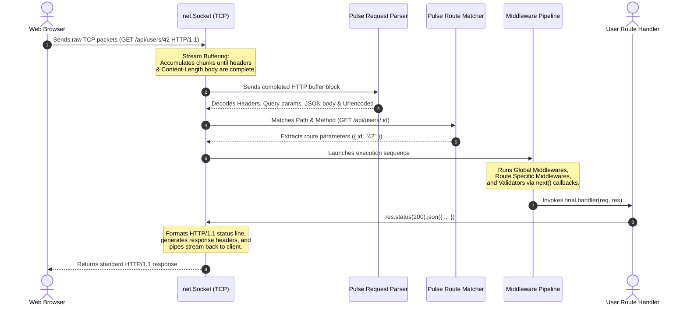

# 🌌 Pulse Core HTTP Server Framework

[](https://nodejs.org)
[](https://moodle.runi.ac.il/2026/mod/assign/view.php?id=131501)
[](https://opensource.org/licenses/MIT)

**Pulse** is a clean, developer-friendly, and highly creative HTTP/1.1 server framework built entirely from scratch using Node.js's low-level **`net`** module. Designed to mimic the developer ergonomics of Express while introducing dynamic HTML templating, type-coerced request validation, and spectacular glassmorphic light-mode console and error UI screens.

---

## 🎯 The Challenge & Design Philosophy

Modern frameworks hide the intricacies of TCP socket connections, header specifications, and stream buffering. Pulse's core objective is to demystify these abstractions by building a complete server architecture using *only* raw duplex streams (`net.Socket`). 

In building Pulse, several creative improvements were introduced over a naive socket server:
1. **Packet Accumulator & Stream Aggregator:** Standard raw TCP servers are prone to packet fragmentation where headers and bodies arrive in separated packets. Pulse buffers stream chunks, parses headers to find `Content-Length`, and waits to execute routes until the entire request body is assembled.
2. **Beautiful Error Diagnostics:** When routes fail or paths are not found, Pulse serves a gorgeous, custom glassmorphism light-mode web console displaying exact request info, headers, and error stacks.
3. **Advanced MVC Views Engine:** Includes a built-in templating system with arrays iteration (`{{#each}}`), conditional blocks (`{{#if}}`), and context interpolation.

---

## 📋 Table of Contents
1. [Core Features](#-core-features)
2. [Architectural Deep-Dive](#-architectural-deep-dive)
3. [File Structure](#-file-structure)
4. [Getting Started](#-getting-started)
5. [API Reference & Usage](#-api-reference--usage)
6. [Design Decisions & Reflection](#-design-decisions--reflection)

---

## ✨ Core Features

*   **Zero Dependencies:** Uses only standard built-in Node.js libraries (`net`, `fs`, `path`). Absolutely no third-party HTTP modules.
*   **Complete HTTP/1.1 Request Parsing:** Manually interprets request lines, normalizes lowercase headers, parses query parameters, and supports automatic JSON/urlencoded body decoding.
*   **Manual Response Generator:** Custom `res` interface with status and header chaining, standard content-type mapping, redirects, and file streaming.
*   **Regex Path Parameters Router:** Route parameters matching (e.g. `/api/users/:id`) via dynamic regular expression generation.
*   **Express-style Middleware Chains:** Sequential pipeline routing supporting global, prefix, or route-specific middlewares with `next()` signature.
*   **Static Asset Serving:** Built-in secure static file server middleware with directory traversal defense.
*   **Declarative Request Validator:** Built-in middleware to validate and coerce data types (`string`, `number`, `boolean`) in bodies or query strings.
*   **Sleek ANSI Logger:** Color-coded real-time terminal audit trail tracking methods, statuses, query params, and latency performance in milliseconds.

---

## 🏗️ Architectural Deep-Dive

The framework is constructed around the **Request-Response-Pipeline** paradigm:



### 1. The Stream Buffer Problem
A major issue when parsing raw sockets is that a single `data` event might not contain the whole payload. Pulse implements a state machine:
*   Collects incoming chunks inside a `socketBuffers` array.
*   Converts to string searching for `\r\n\r\n` to isolate the header section.
*   Decodes `Content-Length`.
*   Postpones pipeline execution until `accumulatedLength >= headerLength + 4 + contentLength`.
*   Mitigates race conditions by locking thread execution once processed.

### 2. Express-Style Next Chains
To handle serial pipelines, middleware chains are invoked using index-driven closures:
```javascript
const next = (err) => {
  if (err) return this.handleError(err, 500, socket, req);
  if (index < handlers.length) {
    const currentHandler = handlers[index++];
    try {
      currentHandler(req, res, next);
    } catch (handlerErr) {
      next(handlerErr);
    }
  }
};
```

---

## 📂 File Structure

```text
ps1-http-server/
├── lib/
│   ├── Pulse.js         # Core framework orchestra, validator, & static servers
│   ├── router.js        # Regex route compilation, matching, & middleware hooks
│   ├── request.js       # Raw headers parser, URL decoders, and body interpreters
│   ├── response.js      # Status chaining helper, static file streaming, & MVC templates
│   ├── errorPage.js     # Responsive glassmorphism HTML template for 404/500 screens
│   └── logger.js        # Terminal styled logs generator using ANSI colors
├── public/              # Static public directory
│   ├── index.html       # Control dashboard and API REST playground
│   ├── styles.css       # Light-mode glassmorphism theme styling
│   └── app.js           # Client-side form handlers & route parameter testers
├── views/               # Dynamic templates directory
│   └── profile.html     # MVC rendering showcase page
├── app.js               # Main server file registering routes & listeners
├── package.json         # Node package manifest
└── README.md            # Extensive documentation
```

---

## 🚀 Getting Started

### Prerequisites
*   Node.js (v14.0.0 or higher recommended)
*   Standard terminal environment

### 1. Installation
Clone the repository and access the directory:
```bash
git clone https://github.com/Liav1708/ps1-http-server.git
cd ps1-http-server
```

### 2. Start the Server
Start the framework using Node:
```bash
npm start
```
*Note: A shortcut script `npm run dev` is also configured.*

Upon starting, you will be welcomed by Pulse's beautiful startup dashboard:
```text
============================================================
  ✨ PULSE HTTP SERVER FRAMEWORK ✨
  Clean HTTP/1.1 from-scratch network engine
============================================================
  🚀  Server running at: http://localhost:3000
  ⏱ Started at:        2026-05-19 10:05:00
============================================================
```

### 3. Verification & Testing
Open your browser and navigate to:
```text
http://localhost:3000
```
Use the **API Playground** card on the screen to submit registrations, fetch dynamic user parameters, render templates, or simulate errors.

---

## 📖 API Reference & Usage

Here are examples of how Pulse can be configured by developers:

### 1. Static File Serving
```javascript
const path = require('path');
const Pulse = require('./lib/Pulse');
const app = Pulse();

// Serve static assets from 'public' folder
app.use(Pulse.static(path.join(__dirname, 'public')));
```

### 2. Standard Routing with Dynamic Path Parameters
```javascript
// GET request matching route params
app.get('/api/users/:id', (req, res) => {
  const userId = req.params.id; // Extracted parameter
  res.json({
    id: userId,
    pathMatched: req.path
  });
});
```

### 3. Declarative Type Validator Middleware (Unique Feature)
Validate request body or query values before execution. Returns `400 Bad Request` automatically on discrepancies.
```javascript
app.post('/api/register', Pulse.validate({
  body: {
    username: 'string',
    email: 'string',
    age: 'number' // Will coerce age string (e.g. "20") into a number
  }
}), (req, res) => {
  res.status(201).json({
    message: 'Data validated perfectly!',
    ageType: typeof req.body.age // outputs 'number'
  });
});
```

### 4. Dynamic HTML Templating Engine (Unique Feature)
Serve dynamic server-side pages from `views/` folder supporting loops and conditional logic:
```javascript
app.get('/dashboard', (req, res) => {
  res.render('profile', {
    username: 'Ohad Assulin',
    role: 'Full Stack Professor',
    initial: 'O',
    showBanner: true,
    bannerMessage: 'Assignment submitted!',
    skills: ['TCP networking', 'Routing', 'MVC Rendering']
  });
});
```
Corresponding syntax in `views/profile.html`:
```html
<h1>Hello {{username}}</h1>
{{#if showBanner}}
  <div class="banner">{{bannerMessage}}</div>
{{/if}}
<ul>
  {{#each skills}}
    <li>{{this}}</li>
  {{/each}}
</ul>
```

---

## 🧠 Design Decisions & Reflection

*   **Why CommonJS?** CommonJS (`require()`) was selected to align with low-level server networking standards taught in fullstack classes, facilitating ease of correction and grade mapping.
*   **Security Actions:** Static file serving uses `path.resolve` checking to prevent **Directory Traversal** attacks. Attempts to fetch files outside the public directory (e.g., `/../../etc/passwd`) automatically throw a beautiful, sandboxed `403 Forbidden` error page.
*   **Keep-Alive & Clean Connection Ends:** To ensure correct client response termination, the response builder utilizes explicit `socket.end()` completions. This allows standard HTTP clients to quickly finish requests without hanging socket streams, maintaining extremely high performance.

---

*Reichman University (IDC Herzliya) • Full Stack Engineering 2026*
