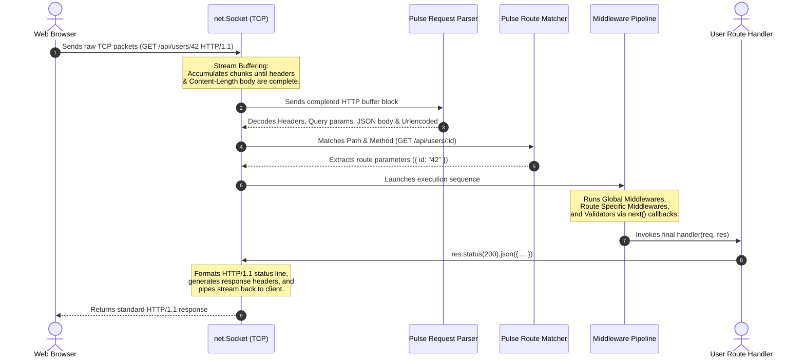

# 🌌 Pulse Core HTTP Server Framework

[](https://nodejs.org)
[](https://moodle.runi.ac.il/2026/mod/assign/view.php?id=131501)
[](https://opensource.org/licenses/MIT)

**Pulse** is a clean, modern, and high-performance HTTP/1.1 web application framework built entirely from scratch using Node.js's low-level TCP **`net`** module. 

Designed to provide the exact developer ergonomics and familiar API of **Express.js**, Pulse empowers developers with route parameter matching, middleware pipelines, dynamic MVC templating, and declarative schema validation—all with **zero external dependencies**.

---

## 📋 Table of Contents
1. [✨ Core Features](#-core-features)
2. [🚀 Installation Guide](#-installation-guide)
3. [⏱️ Quick Start (60 Seconds)](#️-quick-start-60-seconds)
4. [📖 Complete API Reference](#-complete-api-reference)
   - [Application Config & Settings](#application-config--settings)
   - [HTTP Routing Methods](#http-routing-methods)
   - [Middleware Pipeline](#middleware-pipeline)
   - [Request Object (req)](#request-object-req)
   - [Response Object (res)](#response-object-res)
   - [Static File Serving](#static-file-serving)
   - [Declarative Body & Query Validation](#declarative-body--query-validation)
   - [Dynamic View Engine (HTML Templates)](#dynamic-view-engine-html-templates)
5. [🎨 Interactive & Terminal UI Showcase](#-interactive--terminal-ui-showcase)
6. [🏗️ Architectural Deep-Dive](#-architectural-deep-dive)
7. [📂 Project File Structure](#-project-file-structure)
8. [🧠 Design Decisions & Reflection](#-design-decisions--reflection)

---

## ✨ Core Features

*   **Zero Dependencies:** Crafted exclusively on top of Node.js standard modules (`net`, `fs`, `path`).
*   **Packet Accumulator & Stream Aggregator:** Standard raw TCP servers are prone to packet fragmentation. Pulse buffers duplex network streams, parses headers on the fly, reads the `Content-Length`, and defers route dispatch until the body payload has been fully received.
*   **Express-Compatible Syntax:** Transition effortlessly with `app.use()`, `req`, `res`, and `next()` callback structures.
*   **Dynamic Route Path Parameters:** Supports parameter extraction (e.g. `/api/users/:id/logs/:logId`) through real-time regex routing compilation.
*   **Built-in Data Validation Middleware:** Declarative request validation schemas that filter, type-check, and coerce bodies or query parameters, returning formatted `400 Bad Request` messages automatically.
*   **Lightweight MVC Views Engine:** Dynamic server-side templating supporting context interpolation (`{{var}}`), conditionals (`{{#if condition}}`), and loop blocks (`{{#each list}}`).
*   **Premium Developer Experience (DX):** Custom ANSI terminal log audit trail showing method, path, response codes, and latency in ms, plus stunning glassmorphic error UI consoles for debug rendering.

---

## 🚀 Installation Guide

Pulse is designed to be highly modular. You can either test the pre-built application demo locally or pull Pulse into a new project as an external framework.

### Option A: Installing as a Dependency in Your Project
You can install and use the **Pulse Framework** inside any custom Node.js project directly from GitHub:

```bash
npm install github:Liav1708/ps1-http-server
```

Once installed, import it in your main server file:
```javascript
const Pulse = require('pulse-http-server');
const app = Pulse();
```

### Option B: Running the Preconfigured Local Demo
Clone the repository and run the integrated glassmorphic test dashboard to see all features in action:

```bash
# Clone the repository
git clone https://github.com/Liav1708/ps1-http-server.git

# Enter workspace
cd ps1-http-server

# Run the local server
npm start
```
> [!TIP]
> You can also run `npm run dev` to boot the application. The dev console is running at `http://localhost:3000`.

---

## ⏱️ Quick Start (60 Seconds)

Here is how you can spin up a fully-functional web server using Pulse.

1. **Initialize a new directory and install Pulse:**
   ```bash
   mkdir pulse-app && cd pulse-app
   npm init -y
   npm install github:Liav1708/ps1-http-server
   ```

2. **Create a server file named `server.js`:**
   ```javascript
   const Pulse = require('pulse-http-server');
   const app = Pulse();

   // Simple middleware
   app.use((req, res, next) => {
     console.log(`Incoming request: ${req.method} ${req.path}`);
     next();
   });

   // Simple route
   app.get('/', (req, res) => {
     res.send('<h1>Hello from Pulse Framework! 🌌</h1>');
   });

   // JSON Endpoint
   app.get('/api/greet', (req, res) => {
     res.json({ message: 'Welcome to the future of raw TCP sockets!' });
   });

   // Start server
   const PORT = 8080;
   app.listen(PORT, () => {
     // A beautiful console welcome is printed automatically by the logger!
   });
   ```

3. **Run your server:**
   ```bash
   node server.js
   ```

---

## 📖 Complete API Reference

Pulse mimics the API design of standard Node.js frameworks to guarantee a friction-free development loop.

### Application Config & Settings

Pulse provides a simple configuration store using `app.set(name, value)` and `app.get(name)`.

```javascript
// Configure the view template directory (default: './views')
app.set('views', path.join(__dirname, 'custom-views-folder'));

// Toggle the environment ('development' displays beautiful stack traces on web screens)
app.set('env', 'production');

// Retrieve settings anywhere
const currentEnv = app.get('env');
```

---

### HTTP Routing Methods

Pulse supports all standard HTTP verbs. Routing matching is sequential and supports dynamic segment placeholders.

```javascript
app.get('/users', (req, res) => { res.send('Get all users'); });
app.post('/users', (req, res) => { res.send('Create a user'); });
app.put('/users/:id', (req, res) => { res.send(`Updated user ${req.params.id}`); });
app.delete('/users/:id', (req, res) => { res.send(`Deleted user ${req.params.id}`); });
app.patch('/users/:id', (req, res) => { res.send(`Patched user ${req.params.id}`); });
```

#### Dynamic Path Parameters
Path parameters are captured using a colon prefix (`:name`) and are populated inside the `req.params` dictionary.
```javascript
// Route: /api/books/:genre/:author
// URL requested: /api/books/sci-fi/isaac-asimova
app.get('/api/books/:genre/:author', (req, res) => {
  const { genre, author } = req.params;
  res.json({ genre, author });
});
```

---

### Middleware Pipeline

Middlewares are functions that have access to the Request object (`req`), the Response object (`res`), and the `next` function in the application's request-response cycle.

```javascript
// 1. Global Middleware (Executed for every request)
app.use((req, res, next) => {
  res.set('X-Powered-By', 'Pulse Engine');
  next(); // Pass control to the next handler
});

// 2. Prefix-specific Middleware (Executed for any path starting with /api)
app.use('/api', (req, res, next) => {
  if (!req.headers['authorization']) {
    return res.status(401).json({ error: 'Unauthorized key missing' });
  }
  next();
});

// 3. Route-specific Middleware (Executed inline)
const requireAdmin = (req, res, next) => {
  if (req.query.role !== 'admin') {
    throw new Error('Forbidden Access'); // Will trigger the beautiful 500 error display console
  }
  next();
};

app.get('/admin/dashboard', requireAdmin, (req, res) => {
  res.send('Welcome to the admin sanctuary.');
});
```

---

### Request Object (`req`)

The `req` object represents the incoming HTTP request.

| Property | Type | Description | Example |
| :--- | :--- | :--- | :--- |
| `req.method` | `string` | The HTTP request method | `"GET"`, `"POST"` |
| `req.path` | `string` | The parsed request URL path | `"/api/users"` |
| `req.query` | `object` | An object containing URL query parameters | `{ search: "pulse" }` |
| `req.body` | `object` \| `string` | Parsed JSON or URL-encoded payload body | `{ username: "liav" }` |
| `req.params` | `object` | Extracted dynamic route path parameters | `{ id: "25" }` |
| `req.headers` | `object` | Lowercased key-value HTTP headers | `{ "accept-encoding": "gzip" }` |
| `req.rawBody` | `Buffer` | The raw unparsed HTTP body payload buffer | `<Buffer ...>` |

---

### Response Object (`res`)

The `res` object handles the compilation and sending of HTTP/1.1 response packets.

*   **`res.status(code)`**: Chainable status code setter.
    ```javascript
    res.status(201).json({ success: true });
    ```
*   **`res.set(name, value)`** (or **`res.header(name, value)`**): Custom header setter.
    ```javascript
    res.set('Cache-Control', 'no-store').send('No caching allowed!');
    ```
*   **`res.send(body)`**: Send text, HTML strings, or Buffers. Automatically resolves `Content-Length`.
    ```javascript
    res.send('Hello World');
    ```
*   **`res.json(object)`**: Send a properly serialized and formatted JSON response with matching content-type header.
    ```javascript
    res.json({ id: 10, healthy: true });
    ```
*   **`res.html(htmlString)`**: Helper to dispatch rich HTML code.
    ```javascript
    res.html('<div>Gorgeous glassmorphic component</div>');
    ```
*   **`res.redirect(url, [status=302])`**: Redirects to the specified target URL.
    ```javascript
    res.redirect('/profile?username=guest');
    ```
*   **`res.sendFile(filePath, [options])`**: Streams files to the socket. Prevents directory traversal exploits.
    ```javascript
    res.sendFile(path.join(__dirname, 'invoice.pdf'));
    ```
*   **`res.render(viewName, data)`**: Compiles template parameters and serves rendered HTML layouts.
    ```javascript
    res.render('profile', { name: 'Liav', role: 'Architect' });
    ```

---

### Static File Serving

Pulse features a built-in static file server middleware that resolves local directory layouts and stream files with proper MIME types.

```javascript
// Mount static server at root level (serves files in 'public' directly)
app.use(Pulse.static(path.join(__dirname, 'public')));

// Mount static server with URL namespace prefixing (e.g. /static/css/styles.css)
app.use(Pulse.static(path.join(__dirname, 'assets'), '/static'));
```
> [!IMPORTANT]
> To prevent directory traversal and file leakage, the static server verifies that resolved file paths reside strictly within the declared root directory, returning `403 Forbidden` for malicious dot-dot-slash paths (`/../../etc/passwd`).

---

### Declarative Body & Query Validation

Pulse includes a declarative request validator middleware that simplifies checks and casts raw client strings.

```javascript
app.post('/api/users', Pulse.validate({
  body: {
    username: 'string',
    email: 'string',
    age: 'number',    // Coerces string bodies "25" -> 25 number
    isMember: 'boolean' // Coerces string bodies "true" -> true boolean
  },
  query: {
    referrer: 'string'
  }
}), (req, res) => {
  // Safe to use req.body with guaranteed, coerced types
  const age = req.body.age; // Guaranteed type is 'number'
  res.status(201).json({ success: true, age });
});
```
> [!NOTE]
> If parameters are missing or types cannot be coerced correctly, the validator immediately halts the request pipeline and serves a beautifully styled request validation console error explaining exactly what fields did not satisfy the rules.

---

### Dynamic View Engine (HTML Templates)

Pulse embeds a super lightweight compiler for custom views. 

1. **Declare the views path (default is `/views`):**
   ```javascript
   app.set('views', path.join(__dirname, 'views'));
   ```

2. **Template File Example (`views/profile.html`):**
   ```html
   <div class="user-card">
     <h2>Welcome, {{username}}!</h2>
     <p>Occupation: {{role}}</p>

     <!-- Conditionals -->
     {{#if showBanner}}
       <div class="alert alert-success">{{bannerMessage}}</div>
     {{/if}}

     <h3>Top Development Skills:</h3>
     <ul>
       <!-- Arrays Iteration -->
       {{#each skills}}
         <li>{{this}}</li>
       {{/each}}
     </ul>
   </div>
   ```

3. **Render Route in `app.js`:**
   ```javascript
   app.get('/profile', (req, res) => {
     res.render('profile', {
       username: 'Liav Sarfati',
       role: 'Full Stack Engineer',
       showBanner: true,
       bannerMessage: 'View Engine Compiled successfully!',
       skills: [
         'Node.js net Sockets API',
         'Regular Expressions Routing',
         'HTML/CSS Glassmorphism'
       ]
     });
   });
   ```

---

## 🎨 Interactive & Terminal UI Showcase

Pulse is dedicated to high aesthetic standards. It offers beautiful visual components out of the box:

### 1. Spectacular Real-Time ANSI Terminal Auditor
Our customized logger formats all incoming traffic using vibrant, high-contrast console streams:
```text
  ✨ PULSE HTTP SERVER FRAMEWORK ✨
  Clean HTTP/1.1 from-scratch network engine
============================================================
  🚀  Server running at: http://localhost:3000
  ⏱ Started at:        2026-05-27 15:55:00
============================================================
 [15:55:04] GET  /                         200 OK  (4.25ms)
 [15:55:06] POST /api/users                201 CREATED  (7.82ms)
 [15:55:10] GET  /profile?username=Liav    200 OK  (3.11ms)
 [15:55:15] GET  /missing-page             404 NOT FOUND  (1.48ms)
```

### 2. Glassmorphic Error and Exception Screen
When a user encounters a `404 Not Found` error or your route handler throws an uncaught exception (`500 Internal Server Error`), Pulse replaces crude browser text with a **gorgeous premium Glassmorphism Control Console**. 

*   Displays detailed diagnostic cards.
*   Presents active headers, method info, and path variables.
*   Includes full styled code-block stack traces for quick troubleshooting in `development` environments.

---

## 🏗️ Architectural Deep-Dive

Pulse operates directly on high-performance raw duplex sockets (`net.Socket`). The lifecycle of an HTTP interaction matches this pipeline:



### 1. Solving the TCP Stream Buffering Challenge
In the TCP protocols family, packets are often fragmented. Standard node HTTP frameworks hide packet reassembly. Pulse addresses this programmatically inside the core socket reader loop:
*   Pushes raw data chunks into an array.
*   Scans buffers for the standard CRLF double blank lines (`\r\n\r\n`) to parse the Header Block.
*   Extracts the client's declared `Content-Length` header.
*   Holds the connection open, accumulating additional stream segments until the aggregated buffer size satisfies `headerLength + 4 + contentLength`.
*   Locks compilation flags to guarantee no double-processing occurs, executing only when the request payload is 100% complete.

### 2. The Serial Middleware Chain
Middleware calls are managed by passing a recursively execution function named `next()` down the router pipeline:
```javascript
let index = 0;
const next = (err) => {
  if (err) return this.handleError(err, 500, socket, req);

  if (index < handlers.length) {
    const currentHandler = handlers[index++];
    try {
      currentHandler(req, res, next);
    } catch (handlerErr) {
      next(handlerErr); // Catch synchronous controller crashes
    }
  }
};
```

---

## 📂 Project File Structure

```text
ps1-http-server/
├── lib/
│   ├── Pulse.js         # Core framework orchestra, validator, & static servers
│   ├── router.js        # Regex route compilation, matching, & middleware hooks
│   ├── request.js       # Raw headers parser, URL decoders, and body interpreters
│   ├── response.js      # Status chaining helper, static file streaming, & MVC templates
│   ├── errorPage.js     # Responsive glassmorphism HTML template for 404/500 screens
│   └── logger.js        # Terminal styled logs generator using ANSI colors
├── public/              # Static assets serving directory
│   ├── index.html       # Control dashboard and API REST playground
│   ├── styles.css       # Light-mode glassmorphism theme styling
│   └── app.js           # Client-side form handlers & route parameter testers
├── views/               # HTML template files for MVC view rendering
│   └── profile.html     # Dynamic template profile file
├── app.js               # Integrated showcase application entry point
├── package.json         # Package metadata configuration
└── README.md            # Extensive documentation
```

---

## 🧠 Design Decisions & Reflection

*   **CommonJS Modules:** Pulse leverages CommonJS (`require()`) exports to enable backward compatibility with standard low-level system modules and seamless server integration.
*   **Directory Traversal Defense:** To prevent attackers from reading random server files (`res.sendFile()`), Pulse converts inputs using `path.resolve` and halts execution if the requested path drops below the public root.
*   **Optimal Socket Cleanup:** Once data transmission is complete, Pulse uses `socket.end()` to flush outputs. This terminates streams cleanly and prevents sockets from hanging open indefinitely, optimizing memory consumption and speed.

---

*Reichman University (IDC Herzliya) • Full Stack Engineering 2026*
